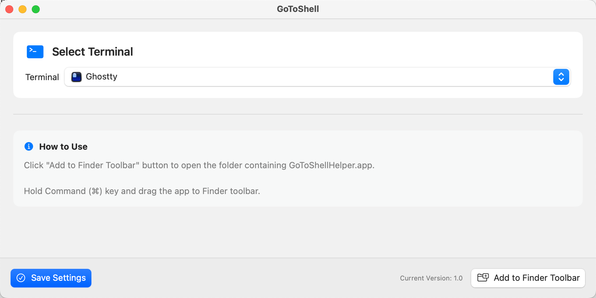

<p align="center">
  <a href="https://github.com/covoyage/GoToShell">
    

  </a>
</p>

<h1 align="center">
  GoToShell - A macOS app that lets you quickly open a terminal in your current Finder directory.
</h1>

<div align="left">

**English | [简体中文](./README_zh-CN.md)**

</div>

<p align="center">
  
</p>

## Features

- 🚀 One-click terminal access from any Finder location
- 🎯 Supports 10 popular terminal apps (Terminal, iTerm2, Warp, Alacritty, Ghostty, Hyper, Kitty, WezTerm, Tabby, Black Box)
- 🌍 Bilingual interface (English & Chinese)
- 🍎 Native macOS app, lightweight and fast
- ⚡ Always opens a new terminal window, even if the app is already running

## How to Use

### Step 1: Configure the App

1. Open `GoToShell`
2. Select your preferred terminal application
3. Click "Save Settings"

### Step 2: Add to Finder Toolbar

1. Click the "Add to Finder Toolbar" button
2. The app will automatically:
   - Open the folder containing `GoToShellHelper.app` (with the file pre-selected)
3. Hold down the Command (⌘) key
4. Drag `GoToShellHelper.app` to any Finder window's toolbar
5. Release to place it

That's it! No need to hunt for file paths.

### Step 3: Use It

1. Navigate to any folder in Finder
2. Click the GoToShell icon in the toolbar
3. A new terminal window opens in that directory

## Supported Terminals

- **Terminal** - macOS default terminal
- **iTerm2** - Feature-rich terminal replacement
- **Warp** - Modern terminal with AI features
- **Alacritty** - GPU-accelerated terminal emulator
- **Ghostty** - Fast, native terminal
- **Hyper** - Electron-based terminal
- **Kitty** - GPU-accelerated terminal
- **WezTerm** - Cross-platform terminal
- **Tabby** - Modern terminal with tabs
- **Black Box** - GTK4-based terminal

The app automatically detects which terminals you have installed and only shows available options.

## System Requirements

- macOS 14.0 or later
- Supports both Apple Silicon (arm64) and Intel (x86_64) architectures

## FAQ

### Q: The toolbar icon doesn't respond when clicked?

A: Make sure:
1. `GoToShellHelper.app` is properly added to the toolbar
2. You've selected a terminal in the app settings
3. Check System Settings → Privacy & Security → Accessibility for permissions

### Q: How do I switch to a different terminal?

A: Open `GoToShell`, select a new terminal, and click "Save Settings".

### Q: How do I remove the toolbar icon?

A: Right-click the Finder toolbar, select "Customize Toolbar", then drag the icon out.

### Q: How do I verify the download integrity?

A: Download the corresponding `.sha256` file and run:
```bash
shasum -a 256 -c GoToShell-x.x.x-arm64.dmg.sha256
```

### Contributing

Issues and Pull Requests are welcome!

## License

AGPL-3.0 License

## Acknowledgments

Thanks to all contributors and users for their support!
